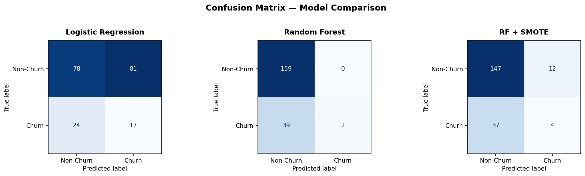
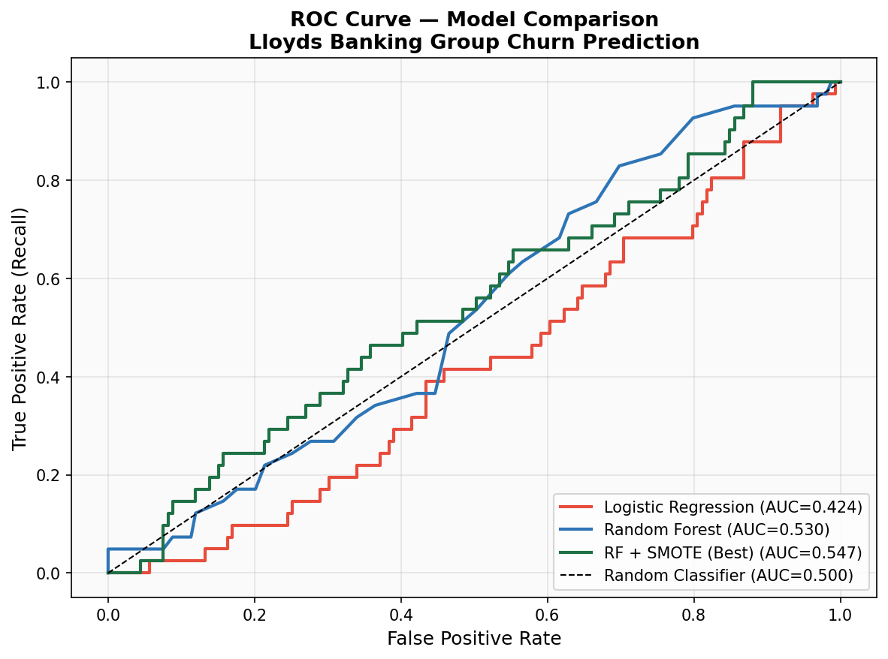
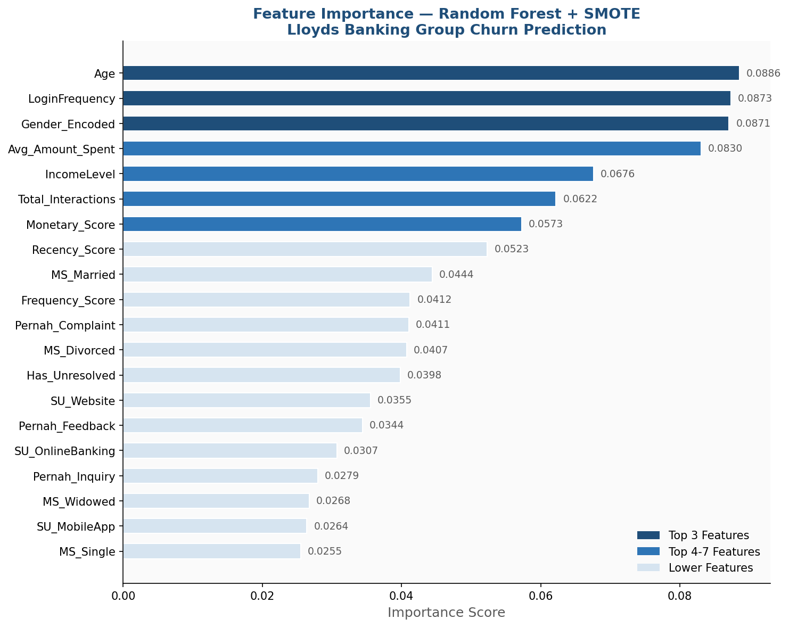

# Customer Churn Risk Prediction — Lloyds Banking Group

**Forage Simulation Program** | May 2026
**Prepared by:** Muhammad Fajar

---

## Project Background

Acquiring a new customer in the banking industry is known to cost 5–7 times more than retaining an existing one. Lloyds Banking Group faces a **churn rate of 20.4%** — equivalent to 1 in 5 customers leaving the service — yet lacks a system capable of detecting churn risk early.

This project aims to build a thorough understanding of churn-prone customer behavior, then develop a machine learning model to predict that risk, enabling the retention team to intervene proactively rather than reactively.

The project was carried out in two stages:
- **Task 1** — Data Gathering, Exploratory Data Analysis (EDA), and Preprocessing
- **Task 2** — Machine Learning Model Development and Evaluation

---

## Task 1 — Data Gathering, EDA & Preprocessing

### Data Source & Structure

The dataset consists of 5 relational tables aggregated to customer level (`CustomerID`), resulting in a `Customer_Level` table with 1,000 rows and 21 analytical features.

| Table | Rows | Relation | Description |
|---|---|---|---|
| Customer_Demographics | 1,000 | 1:1 | Customer profile & demographics |
| Transaction_History | 5,054 | 1:Many | Transaction history (1–9 per customer) |
| Customer_Service | 1,002 | 1:Many | Customer service interaction logs |
| Online_Activity | 1,000 | 1:1 | Login activity & channel usage |
| Churn_Status | 1,000 | 1:1 | Target variable: Churn (1) / Retained (0) |

### Data Cleaning & Preprocessing (Excel)

- **Missing values:** all 21 columns were complete (0 missing values) after aggregation to customer level
- **Outliers (IQR method):** found in `Avg_Amount_Spent` (38 outliers, 3.8%) and `Recency_Days` (66 outliers, 6.6%) — retained as they represent valid behavioral variation rather than data entry errors
- **Encoding:** Binary (Gender), Ordinal (IncomeLevel), One-Hot (Marital Status – 4 columns, Service Usage – 3 columns)
- **Normalization:** Min-Max scaling applied to 6 continuous numerical columns, in preparation for the modeling stage

### Exploratory Findings

**Churn distribution:** out of 1,000 customers, 204 (20.4%) were confirmed churned — above the 15% threshold considered an alarm level in the banking industry.

**Churn by demographics:**
- Gender was not a significant factor (Female 19.7% vs Male 21.1%, only a 1.4% gap)
- Low-income customers had the highest churn risk (22.2%), being more sensitive to service fees
- The 31–45 age group recorded the highest churn rate (21.7%) — the segment with the highest customer lifetime value, as they are typically already tied to complex products such as mortgages and investments

**Churn by digital behavior:**
- Mobile App users had the highest churn risk (23.1%), compared to Online Banking (20.1%) and Website (17.8%)
- Churned customers logged in 10.7% less frequently than retained customers (23.65x vs 26.49x) — a strong indicator for early warning detection

**Churn by customer service:** the churn rate gap between customers with unresolved issues (20.9%) and those without (20.0%) was only 0.9% — not significant; customer service resolution quality was not a major differentiating factor in this dataset.

📄 **Full report:** [`Laporan_Analysis_Churn_Customer_Task_1.pdf`](./Laporan_Analysis_Churn_Customer_Task_1.pdf)

---

## Task 2 — Machine Learning Model Development & Evaluation

### Algorithm Selection

Three models were built and compared, considering the dataset's characteristics (80/20 class imbalance, non-linear feature relationships) and the need for business stakeholder interpretability.

| Algorithm | Accuracy | Interpretability | Imbalance Handling | Decision |
|---|---|---|---|---|
| Logistic Regression | Moderate | Very High | Needs tuning | Baseline |
| Random Forest | High | High | Needs tuning | Primary |
| Random Forest + SMOTE | High | High | Handled | **Best Model** |

Random Forest + SMOTE was selected as the primary model because: (1) it captures non-linear patterns that Logistic Regression cannot detect, (2) it produces a feature importance ranking that translates directly into business recommendations, and (3) SMOTE addresses the 80/20 class imbalance by generating synthetic samples for the minority (churn) class.

### Evaluation Results



| Model | Precision (Churn) | Recall (Churn) | F1-Score | ROC-AUC |
|---|---|---|---|---|
| Logistic Regression | 0.17 | 0.41 | 0.24 | 0.424 |
| Random Forest | 1.00 | 0.05 | 0.09 | 0.530 |
| **Random Forest + SMOTE** | 0.25 | 0.10 | 0.14 | **0.548** |



### Feature Importance



The five features with the highest contribution to churn prediction were: **Age**, **Login Frequency**, **Gender**, **Average Transaction Amount**, and **Income Level** — confirming that digital engagement and demographic profile are the primary predictors, consistent with the EDA findings in Task 1.

### Analytical Note: Model Limitations

A test-set ROC-AUC of 0.548 is relatively low, only marginally better than a random classifier (0.500). Further analysis confirmed that **this simulated dataset is synthetic** with a weak underlying signal — all feature correlations with churn status were below 0.1, and there was a substantial gap between the cross-validation score on SMOTE-resampled data (0.926) and the score on the actual test set (0.548), indicating overfitting to synthetic data.

This finding is analytically valuable in itself: it confirms that model performance is highly dependent on the strength of the historical signal in the data, and supports an explicit recommendation to implement the framework on real banking data, which typically shows a much stronger feature-churn correlation (0.3–0.7).

📄 **Full report:** [`Customer_Churn_Prediction_Report.pdf`](./Customer_Churn_Prediction_Report.pdf)

---

## Business Recommendations

1. **Monthly Churn Scoring** — run the model at the start of each month to score the entire customer base, generating a list of high-risk customers requiring intervention
2. **Login Frequency Alert** — set up an automated alert when a customer has not logged in for more than 30 days, based on the strongest early warning signal identified in the EDA
3. **Segmented Retention Program** — design differentiated retention programs per segment: premium product offers for the 31–45 age group, fee waivers/cashback for the low-income segment, and UX improvements for Mobile App users
4. **A/B Testing** — test retention program effectiveness by comparing a control group against a group receiving intervention
5. **Model Retraining** — periodically retrain the model with fresh data to improve prediction accuracy as more historical data accumulates

---

## Tools & Methodology

| Stage | Tools |
|---|---|
| Data Cleaning & Aggregation | Microsoft Excel |
| Exploratory Data Analysis | Microsoft Excel |
| Feature Engineering & Encoding | Microsoft Excel |
| Predictive Modeling (Logistic Regression, Random Forest, SMOTE) | Python (Google Colab) |
| Model Evaluation (Confusion Matrix, ROC Curve, Feature Importance) | Python (Google Colab) |

## Repository Contents

```
├── Laporan_Analysis_Churn_Customer_Task_1.pdf   # EDA & Preprocessing report
├── Customer_Churn_Prediction_Report.pdf         # Machine Learning model report
├── Customer_Churn_Analysis.xlsx                 # Excel file: cleaning, EDA, encoding
├── customer_encoded.csv                         # Preprocessed dataset for modeling
├── confusion_matrix.png
├── feature_importance.png
├── roc_curve.png
└── README.md
```

---
*This project is part of the Forage Simulation Program — Lloyds Banking Group.*
